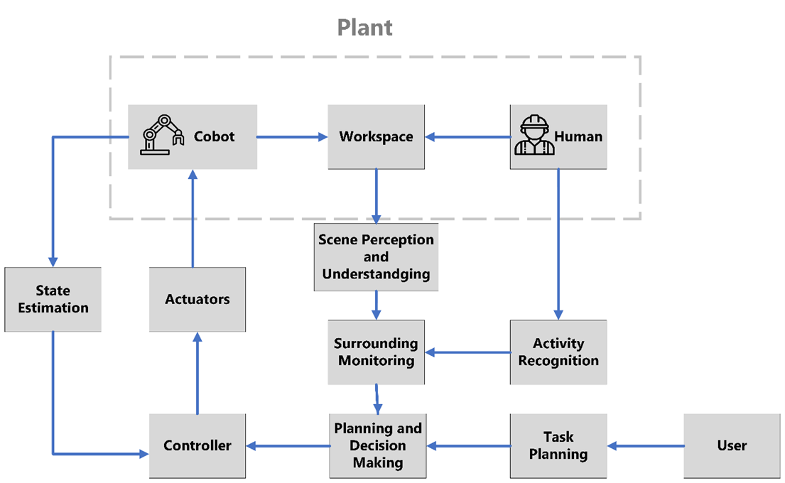
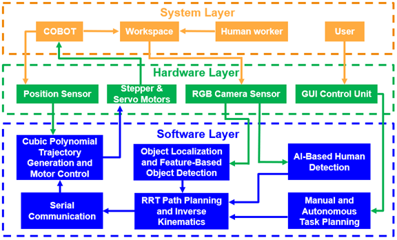
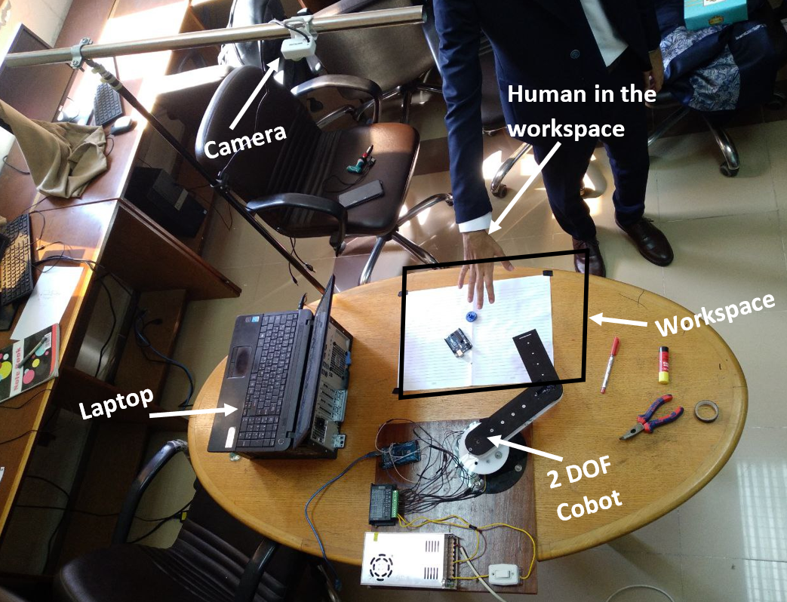
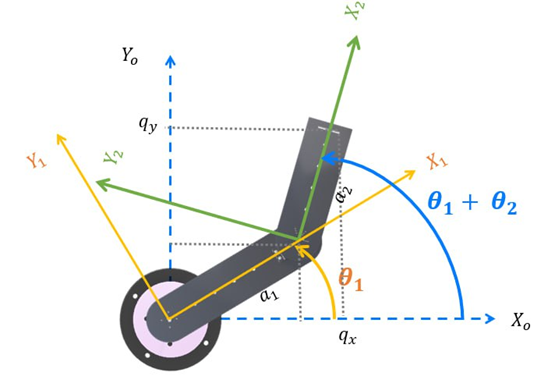

# collaborative robot arm project abstract
A collaborative robot (cobot) manipulator is proposed to work with humans in a shared workspace simultaneously. The cobot is designed based on ISO 10218-1:2011/ISO 10218-2:2011 standards of safety requirements for industrial robots and integrated systems and based on ISO/TS 15066 for collaborative robot’s technical specifications. The collaborative robot consists of a serial robot mechanism with five degrees of freedom and a parallel gripper on the end effector with integrated vision and control unit. The Collaborative robot solves the safety problems in shared workplaces where humans work close to industrial robots. Also, it is used in environments that have uncertainty due to its flexibility and adaptability. The predicted scientific outcomes are (a) a robotic system that can work intelligently with human workers in the same workplace and same time using artificial intelligence and a sensor-based software system that includes a computer vision-based control system with a design that includes safety features, flexibility, and ease of programming as requirements for industry 4.0, and (b) a robotic system that do not shut down when there is a human in the workplace. The cobot is predicted to have (c) a lower cost than the traditional industrial robots due to its small size and compactness.

# Conceptual High-Level Architecture
The following diagram shows a high-level architecture of different subsystems:
 

 
as shown in the diagram above, our plant includes both the robot and the human worker. They interact with each other in a shared workspace simultaneously (collaboration). Along comes, in the middle of the diagram, our surrounding monitoring software module which gets the necessary data on activities occurring in the workspace. It passes data to the decision-making module. Besides, the user interacts with the system by inputting the desired task parameters to the task planning software module to plan for the task. The desired plan is fed to the decision-making module in a suitable form. The decision-making software module becomes fully aware and is now able to determine the path that the robot follows. The path and trajectory data are passed to the controller. After data processing, the controller delivers the output motor commands to the actuators (joint motors) to affect the plant providing absolute safety. Finally, we get feedback state estimations from the robot while operating using different selected sensors to ensure that the robot operates as expected and finishes the tasks correctly.

# Detailed system Architecture
The following diagram shows the system detailed architecture including the three main software modules and how they are connected with the rest of the parts in an abstract way that illustrates the data flow and sequence of operations:
 

 
* The software layer includes three main modules: vision, motion planning and control, and task planning modules. 
* The vision module is responsible for perceiving the environment and detecting the objects to be picked by the robot as well detecting the presence of humans inside the workspace in real time to ensure safety and collision avoidance as being key feature of the collaborative robot during operation. 
* The motion planning and control module is responsible for planning the robot path that is free from obstacles and then creating the appropriate trajectories between each waypoint on the path and controlling the motor movements.
* The task planning module is responsible for receiving inputs from the operator or the user of the cobot, facilitating the task planning part through the GUI by either manual or autonomous modes, then communicating the data between the high and low level control components in the system to achieve seamless data flow and communication between the user and the internal software components.

# Robot Prototype Specifications
The following picture shows the 2DOF cobot prototype that was manufactured and implemented and its workspace setup including the camera, objects to be picked up, and the human presence:
 

 
This image shows the 2 Degrees of freedom collaborative robot prototype that works collaboratively with human workers. The cobot can be programmed to pick components and place, while the human worker handles tasks that require dexterity, decision-making, and creativity such as soldering, testing, and inspection:
 

 
* The system is equipped with an RGB camera that is mounted on top of the workspace and is used for object detection and localization. The camera gives live streams of the objects on the table, and the robot's vision system uses computer vision algorithms to analyze the live video and determine the location of the objects in real time. Once the location of the objects is determined, the cobot arm can be programmed to move to the location.
* To avoid obstacles and collisions with human workers, the cobot uses the same camera. The robot can detect humans in its environment and adjust its behavior accordingly to avoid collisions. This is the “safety-rated monitored stop” level of collaboration.
* The cobot is also programmed to detect which item to pick from several items. 
* The cobot can avoid static obstacles using path planning rrt algorithm and can control its speed using trajectory planning.

# conclusion & future work
* We successfully designed a collaborative robot manipulator for pick and place operations that include a safety rated monitored stop feature to comply with ISO/TS 15066 guidelines which is successfully achieved when the robot stops after detecting a human presence within the workspace and resume its motion after the human disappears. Therefore, the cobot can perceive its workspace, detect desired objects using vision-based control and avoid human collision using AI-based YOLO human detection system. Our cobot system enable user interactions through easy-to-use GUI. We also managed to plan our robot path using sampling-based path planning rrt method that find the shortest path free-of-obstacles from start to goal position while moving in a smoother and more controlled movements using cubic polynomial trajectory generation. Our modular software design allows for easy customization and adaptation to different cobot configurations or changing requirements.
* As a future work, the proposed system could be extended to work seamlessly in unstructured environments by applying more advanced path planning techniques such as dynamic rrt. The robot can have more degrees of freedoms to enable better manipulation in 3D space.  The vision sensor could be extended to have depth estimations to facilitate the work in 3D space. Using force sensing, the robot could be used in more complex collaborative manipulation tasks.
